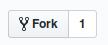
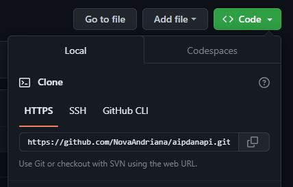

# SMART AIP

Cara penggunaan github untuk berkolaborasi mengelola pekerjaan

## Untuk non Kontributor

### 1. Fork
Fork terlebih dahulu repository yg ingin di patch.

Klik tombol fork



### 2. Copy link untuk clone



lalu jalankan perintah ini:

**git clone < url clone>**

```bash
$ git clone https://github.com/feripratama/noncontrib.git
```


setelah itu pindah ke folder / directory yang telah di clone

```bash
$ cd noncontrib
```


setelah di dalam directory **noncontrib** (sesuaikan dengan directory yang ada)

tambahkan file baru pada local repository, dengan mejalankan perintah seperti berikut:

```bash
$ echo "" > newFile.php
```
atau tambahkan file yang anda ingin upload dari folder lain, misalkan nama foldernya adalah "folder-asal" (sesuaikan path folder-asal tersebut apa perintah dibawah ini:

```bash
$ cp -R ../folder-asal  .
```


jika tidak ada error, maka lanjutkan lagi dengan mengetikkan perintah **git add**:

```bash
$ git add -A
$ git status
```


jika menambahkan file seperti contoh diatas, maka terlihat ada penambahan file baru " **newFile.php** "

lanjut tambahkan branch baru pada repository dengan perintah sebagai berikut:

```bash
$ git checkout -b patch-5
```


sejauh ini kita telah berhasil menambahkan file baru dan menambahkan branch **patch-5**

lalu lanjut mengetikkan perintah **git commit**

```bash
$ git commit -m "add newFile.php"
```


jika berhasil maka tampilan seperti gambar di atas
maka lanjutkan dengan mengetikkan perintah **git push**

```bash
$ git push origin patch-5
```


setelah semua berhasil, buka repository yang di fork di awal tadi


terlihat ada notice patch-5 sama seperti nama branch yang kita tambahkan tadi, lalu klik tombol **Compare & pull request**

setelah tombol **Compare & pull request** di klik maka akan di bawa ke halaman Pull request.


lalu klik tombol **Create pull request**

jika berhasil maka tampilan akan terlihat seperti gambar di bawah:


